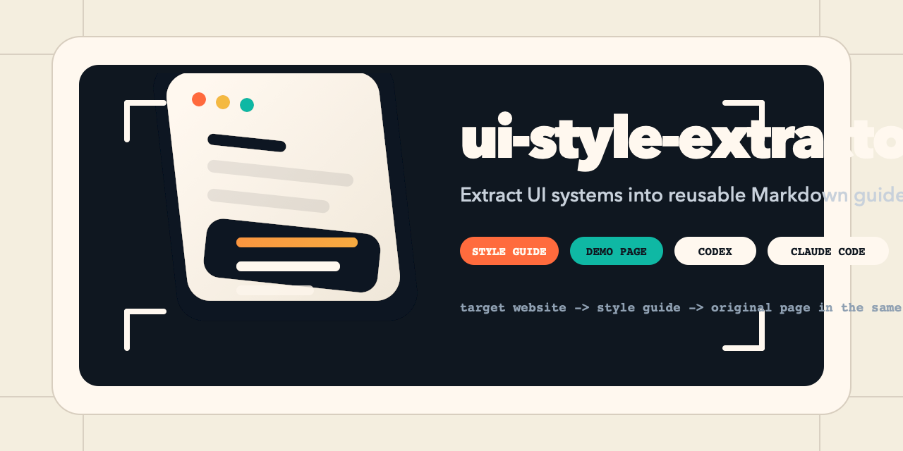
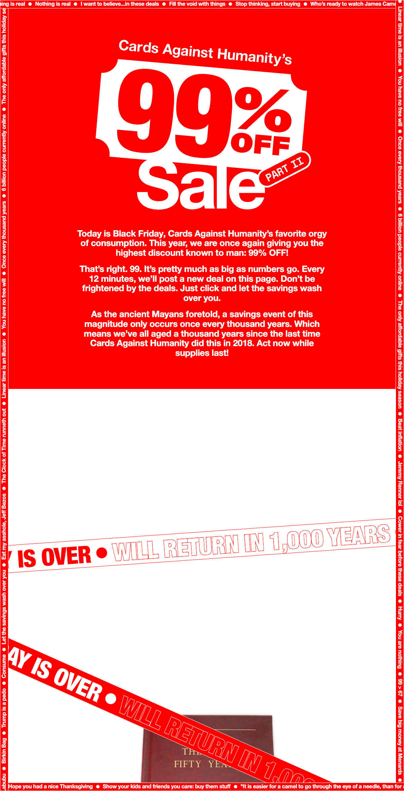
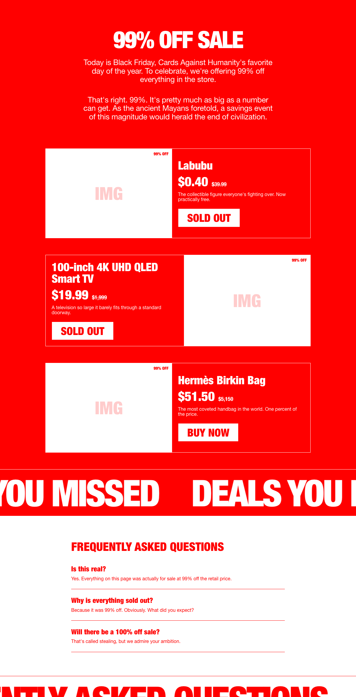
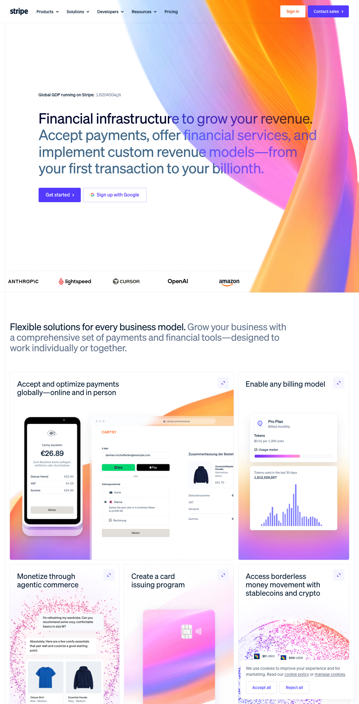
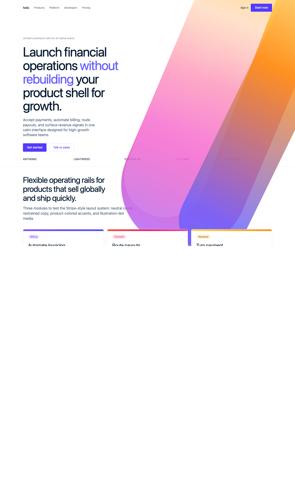
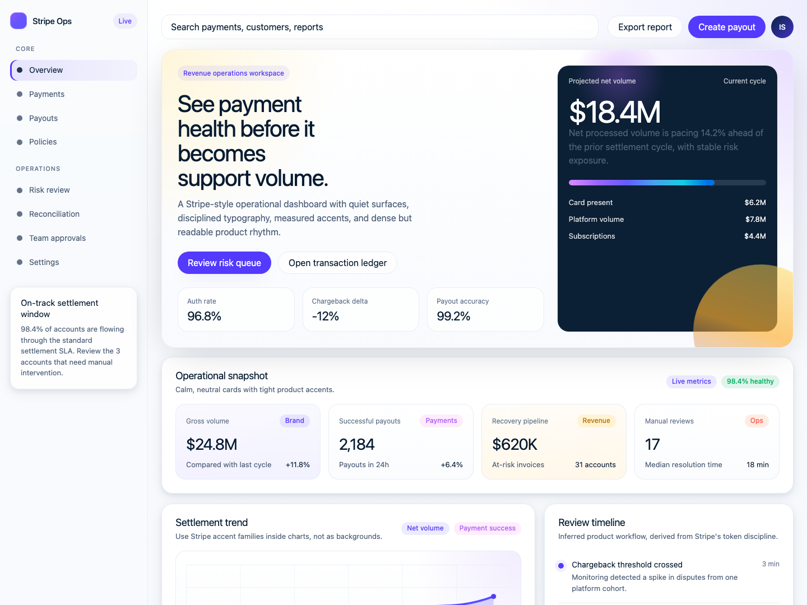

# ui-style-extractor

[English](./README.md) | [中文说明](./README.zh-CN.md)

把一个网站的设计系统提取成可复用的 Markdown 风格指南和验证 demo，供 AI 生成新页面时直接使用。

`ui-style-extractor` 不做“截图转一张一模一样的页面”。它做的是把页面背后的视觉规则抽出来，再交给 AI 使用：颜色、字体、间距、布局、组件、动效，以及那些不容易一句话说清但决定页面气质的约束。

这个仓库包含一个可安装的共享 skill [ui-style-extractor/](./ui-style-extractor/)，同时兼容 Codex 和 Claude Code。

## 它到底解决什么问题

如果你看到一个网站的风格很喜欢，通常只有几种办法：

1. 用截图转代码工具，结果往往只能复刻当前页面，没法继续做新页面
2. 自己凭感觉抄一遍颜色和字体，最后只剩“像一点”
3. 找设计师重做，质量高，但对很多小项目来说太慢也太贵

`ui-style-extractor` 走的是另一条路：提取的是设计系统，不是页面本身。这样你就能让 AI 用同样的视觉语言继续生成新的页面。

## 它会产出什么

- 输入：线上网站、截图、抓下来的 CSS、计算样式、设计 token
- 输出：Markdown 风格指南、可选的 demo 页面、对比验证截图
- 目标：不复用原站内容，但让新页面仍然“像是这个系统里长出来的”

## 快速开始

### 直接安装 skill

主 skill 在 [ui-style-extractor/](./ui-style-extractor/)。

**Codex**

1. 把 `ui-style-extractor/` 复制到 `${CODEX_HOME:-$HOME/.codex}/skills/`
2. 用 `$ui-style-extractor` 调起它

**Claude Code**

1. 把 `ui-style-extractor/` 复制到当前项目 `.claude/skills/` 或 `~/.claude/skills/`
2. 用 `/ui-style-extractor` 调起它

这个仓库还带了一个项目内 wrapper：[`.claude/skills/ui-style-extractor/`](./.claude/skills/ui-style-extractor/)。所以你直接在这个仓库里打开 Claude Code，也能立刻发现这个 skill。

### 不装 skill 也能用

1. 从 [网页案例](#网页案例) 或 [App 案例](#app-案例) 里选一个风格指南
2. 把 `.md` 内容贴给你的 AI 助手
3. 让它基于这个风格写一个全新的页面

## 仓库里有什么

- 一个跨代理可复用的 skill
- 一个可直接复制使用的风格指南模板
- 一个可直接复用的 App UI 风格指南模板
- 两个公开网页案例：`99percent` 和 `stripe`
- 一个公开 App 延展示例：`Stripe`，并补到 dashboard / detail / settings 三张 proof screen
- Stripe 案例附带更完整的原始提取资产

## Skill 内容

- `SKILL.md`：触发说明和提取流程
- `assets/style-guide-template.md`：空白模板
- `assets/app-ui-style-template.md`：App UI 风格指南模板
- `references/extraction-workflow.md`：详细提取方法
- `references/app-adaptation-workflow.md`：如何从网站风格继续推导 App UI
- `references/quality-bar.md`：风格指南和 demo 的完成度标准
- `agents/openai.yaml`：Codex / OpenAI 侧的技能元数据

## 网页案例

### 99% Off Sale -> Product Page

从 Cards Against Humanity 的 [99percentoffsale.com](https://www.99percentoffsale.com/) 提取出极端高对比、零圆角、零阴影、超粗标题的设计系统。

| 风格指南 | 生成页面 |
|----------|----------|
| [99percent-ui-style.md](./99percent/99percent-ui-style.md) | [demo.html](./99percent/demo.html) |

参考图 vs 生成图：

<table>
  <tr>
    <td width="50%"><strong>Reference</strong></td>
    <td width="50%"><strong>Generated</strong></td>
  </tr>
  <tr>
    <td></td>
    <td></td>
  </tr>
</table>

### Stripe Marketing UI -> SaaS Landing Page

从 [stripe.com](https://stripe.com/) 提取 Stripe 营销站常见的中性色体系、渐变点缀、卡片层级和 HDS token 规则。

| 风格指南 | 生成页面 |
|----------|----------|
| [stripe-ui-style.md](./stripe/stripe-ui-style.md) | [demo.html](./stripe/demo.html) |

参考图 vs 生成图：

<table>
  <tr>
    <td width="50%"><strong>Reference</strong></td>
    <td width="50%"><strong>Generated</strong></td>
  </tr>
  <tr>
    <td></td>
    <td></td>
  </tr>
</table>

完整长图验证见：[stripe/demo-fullpage.png](./stripe/demo-fullpage.png)

## App 案例

### Stripe 网站风格 -> Payments Operations App

这一例不是宣称“直接从 Stripe 产品后台提取到了完整 App UI”，而是把同一套网站视觉系统继续推导进一个桌面优先的运营型产品界面里，并扩成 dashboard、detail、settings 三张 proof screen。

| App 指南 | Proof Screens |
|----------|---------------|
| [stripe-app-ui-style.md](./stripe/stripe-app-ui-style.md) | [dashboard](./stripe/app-demo.html) · [detail](./stripe/app-detail-demo.html) · [settings](./stripe/app-settings-demo.html) |

网页来源 vs App 延展：

<table>
  <tr>
    <td width="50%"><strong>Website Source</strong></td>
    <td width="50%"><strong>App Continuation</strong></td>
  </tr>
  <tr>
    <td></td>
    <td></td>
  </tr>
</table>

扩展后的 App proof set：

- Dashboard: [app-demo.html](./stripe/app-demo.html) · [viewport](./stripe/app-demo-viewport.png) · [full page](./stripe/app-demo-fullpage.png)
- Detail: [app-detail-demo.html](./stripe/app-detail-demo.html) · [viewport](./stripe/app-detail-demo-viewport.png) · [full page](./stripe/app-detail-demo-fullpage.png)
- Settings: [app-settings-demo.html](./stripe/app-settings-demo.html) · [viewport](./stripe/app-settings-demo-viewport.png) · [full page](./stripe/app-settings-demo-fullpage.png)

## 风格指南结构

所有风格指南都基于同一套模板，见 [style-guide-template.md](./style-guide-template.md)。

重点 section 包括：

- Overview：整体设计哲学和气质
- Color Palette：主色、辅色、语义色和使用规则
- Typography：字族、字重、字号层级
- Spacing System：间距基准和尺度
- Layout and Containers：栅格、最大宽度、容器逻辑
- Component Styles：按钮、卡片、输入框、导航等
- Animations and Transitions：过渡时长、easing、hover/focus 行为
- Summary of Key Design Rules：最关键、最不能偏的规则

## 自己提取一个新的风格指南

1. 复制 [style-guide-template.md](./style-guide-template.md)
2. 用 DevTools 看目标网站的颜色、字体、间距、组件和布局
3. 能写精确值就写精确值，不要只靠目测
4. 用写好的风格指南继续生成新的页面

提示：也可以直接把截图和模板一起交给 AI，让它先帮你填第一版，再人工修正。

## 项目结构

```text
ui-style-extractor/
├── README.md
├── README.zh-CN.md
├── LICENSE
├── branding/
├── ui-style-extractor/
├── .claude/skills/ui-style-extractor/
├── app-ui-style-template.md
├── style-guide-template.md
├── 99percent/
│   ├── 99percent-ui-style.md
│   └── demo.html
└── stripe/
    ├── stripe-ui-style.md
    ├── stripe-app-ui-style.md
    ├── demo.html
    ├── app-demo.html
    ├── app-detail-demo.html
    ├── app-settings-demo.html
    ├── app-demo-viewport.png
    └── app-*-demo-*.png
```

## FAQ

**这是不是拿来克隆网站的？**

不是。它提取的是视觉语言，不是内容本身。你要生成的是“同一种风格下的新页面”，不是原页面的复印件。

**为什么公开版只有两个案例？**

第一版目标是证明这个方法有跨度，而不是把所有案例一次性放出来。`99percent` 很极端，`Stripe` 很系统化，这两个已经能说明方法有效。

**为什么用 Markdown，而不是 Figma / JSON token？**

因为 Markdown 是所有 LLM 都能直接吃进去的上下文格式，几乎不需要额外插件，也更适合版本管理。

**Codex 和 Claude Code 能共用同一个 skill 吗？**

可以。主 skill 就是 [ui-style-extractor/](./ui-style-extractor/)，`.claude/skills/ui-style-extractor/` 只是为了让 Claude 在本仓库里直接发现它。

**它现在也能产出 App UI 风格指南吗？**

可以，但这层要理解成“基于网站视觉系统继续推导 App 规则”，而不是假装已经从源站直接提取到了完整产品 UI。公开版先用 `Stripe` 做了第一份示范。

**为什么 App 示例先只放 Stripe？**

因为 `Stripe` 最能证明这件事成立：它的网站 token、层级、边框、颜色和信息密度足够系统化，适合继续推导成 App。`99percent` 适合做网页风格提取示例，但不适合作为第一份公开 App 示例。

## License

[MIT](./LICENSE)
